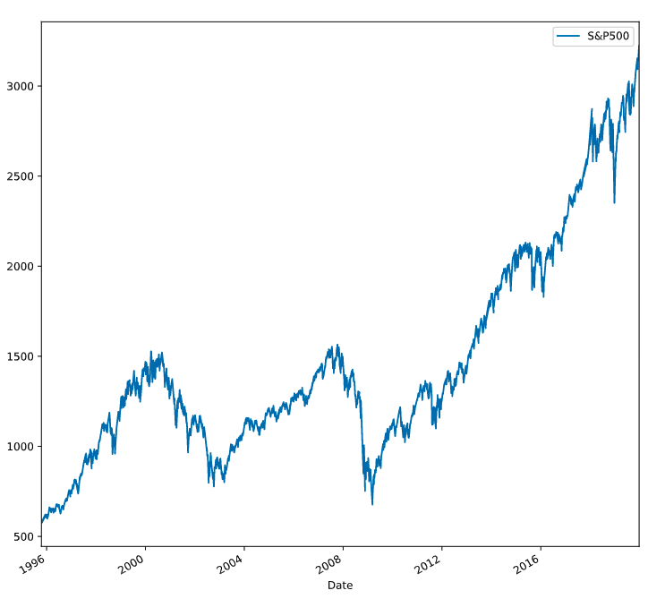
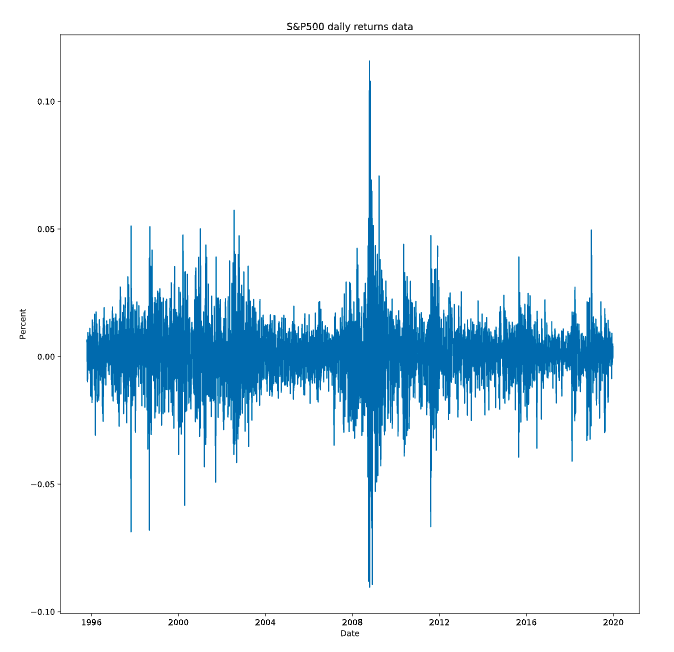
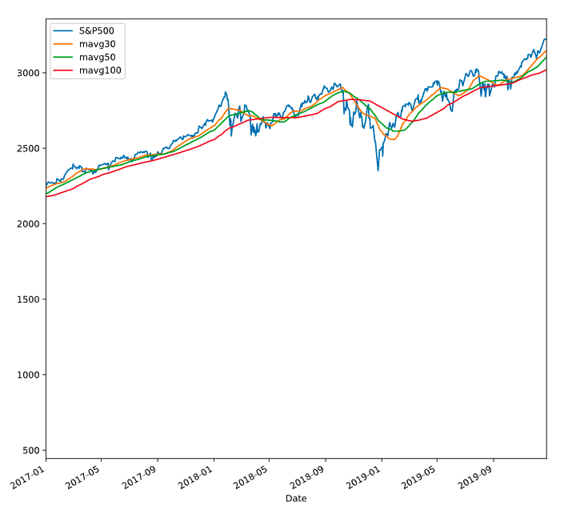

# S&P500 Analysis

<!Add Codacy Badge!>

## S&P Prices

## Daily Returns

## Histogram

## S&P500 Cumulative Returns

## Simple Moving Averages

## Exponential Moving Averages

## US Inflation

## S&P500 vs US Inflation

